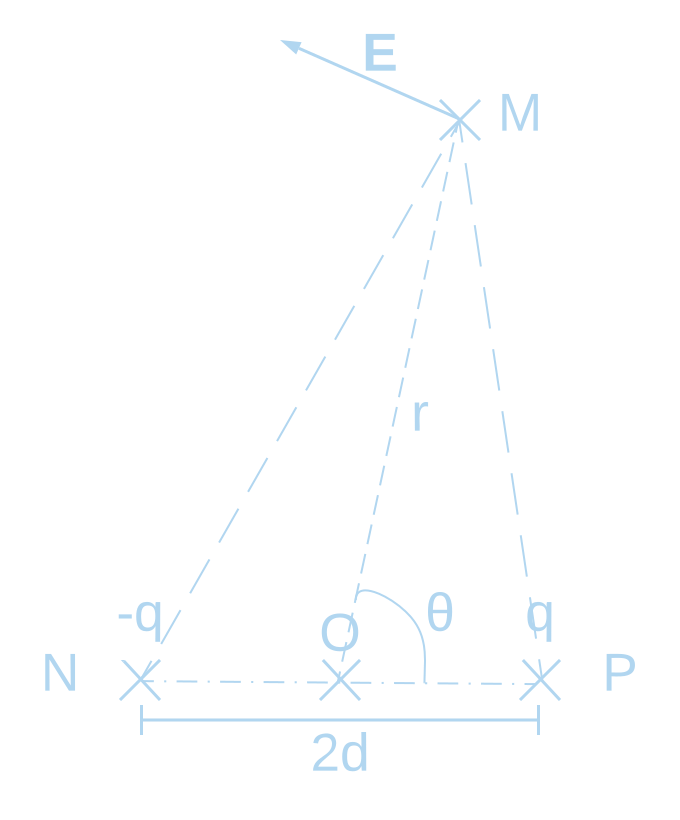

## Simple Answer

The molecules in the air scatter the light coming from the sun.
However, they do not scatter the light with different frequencies equally
and blue light (high frequency) gets far more scattered in the sky, giving it its color.

## Coulomb's Law

To understand how this works, we are first going to need to do some refresh.
This image represents the Coulomb's Law defined by:

$$ \vec{F} = k \frac{q_1 q_2}{r^2} \vec{e_r} $$

Here, $$ \vec{F} $$ represents the force applied by $$ q_1 $$ on $$ q_2 $$, $$ k $$
is the Coulomb's constant equal to $$ \frac{1}{4 \pi \varepsilon_0} $$
and $$ \vec{e_r} $$ is the unit vector going from $$ q_1 $$ to $$ q_2 $$.

Note that if both charges are of the same sign, the force is going to be repulsive,
whereas if the charges have different sign, their product will be negative and the force will be atractive,
which is aligned with what we would expect.

From this force, we can derive the electric field created by $$ q_1 $$:

$$ \begin{align}
  \vec{F} & = q_2 \vec{E}\\
  \implies \vec{E} & = k \frac{q_1}{r^2} \vec{e_r}
\end{align} $$

## Link Between Electric Field And Electric Potential

We also need to recall the link between the electric field and the potential:

$$ \begin{aligned}
  V & = - \int \vec{E} . \vec{\delta l} \\
  \vec{E} & = - \vec{\nabla} V
\end{aligned} $$

Note that the electric potential $$ V $$ is defined with an invariance to shifting by a constant,
(that is why we mostly care about differences of potentials)
most of the time we take that constant so that $$ \lim_{r \to \infty} V = 0 $$.
In the case of a single charged particle as before we get:

$$ V = k \frac{q_1}{r} $$

## Electrostatic Dipole

Now we are going to see what happens when we have two opposites charges affecting the field.
Note that here, $$ O $$ is a point with no charge in the middle of $$ N $$ and $$ P $$, 
we define $$ r $$ as the distance between $$ O $$ and the viewer in $$ M $$.
Given the symmetry of the problem, the electric field has no part outside of the plane and does not depend on what plane containing the charges we are using. Thus, we can only define a single angle $$ \theta = (\vec{OP}, \vec{OM}) $$ 

Note that this graph is not at scale and actually represents a situation where $$ r >> d $$,
which makes sense when we compare the distance between you and an atom in the atmosphere with the distance between an atom's nucleus and its electron cloud.

The electric field has the linearity propriety that makes it possible to calculate it as the sum of the two electric fields that would exist for each of both charged particle. To calculate it we are first going to compute the potential (also linear because integration is linear) and then derive the electrical field from that potential by taking the opposite of its gradient:

$$ \begin{aligned}
  V & = V_+ + V_- \\
  V & = kq \left( \frac{1}{PM} - \frac{1}{NM} \right)
\end{aligned} $$

We are now going to use the fact that $$ r >> d $$ to approximate $$ PM $$ and $$ NM $$.

Since we are very far from the dipole we are looking at, it is as we have parallel lines between the two poles and we can make the following approximation:

$$ \begin{aligned}
  PM \approx P'M & = OM - OP' = r - d \cos \theta \\
  NM \approx N'M & = OM + ON' = r + d \cos \theta
\end{aligned} $$

Here $$ P' $$ and $$ N' $$ are, respectively, the projection of $$ P $$ and $$ N $$ on $$ (OM) $$. We can now have the potential in $$ M $$ with the dipolar moment $$ p = 2qd$$:

$$ \begin{aligned}
  V & = kq \left( \frac{NM - PM}{PM \cdot NM} \right) \\
  & \approx kq \left( \frac{2d \cos \theta}{(r - d \cos \theta)(r + d \cos \theta)} \right) \\
  & = kq \left( \frac{2d \cos \theta}{r^2 - d^2 (\cos \theta)^2} \right) \\
  & \approx \frac{kp \cos \theta}{r^2}
\end{aligned} $$

Okay, now let's compute the electric field where $$ \vec{e_\theta} $$ is $$ \vec{e_r} $$ rotated
by $$ 90° $$ in the counter-clockwise direction:

$$ \begin{aligned}
  \vec{E} & = - \vec{\nabla} V \\
  & \approx - \vec{\nabla} \frac{kp \cos \theta}{r^2} \\
  & = - \frac{\partial V}{\partial r} \vec{e_r} - \frac{1}{r} \frac{\partial V}{\partial \theta} \vec{e_\theta} \\
  & = \frac{2kp \cos \theta}{r^3} \vec{e_r} + \frac{kp \sin \theta}{r^3} \vec{e_\theta} \\
  & = \frac{kp}{r^3} (2 \cos \theta \vec{e_r} + \sin \theta \vec{e_\theta})
\end{aligned} $$

## Rayleigh Scattering
d << lambda
ARQS
### Excitation (why dipole)
- Calculate B
### Poynting Vector
- E x B / mu_0
### Final Formula
- Integral
