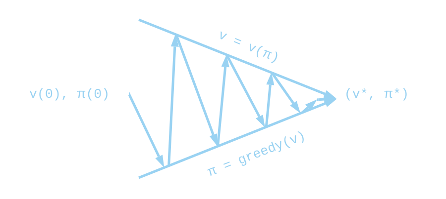
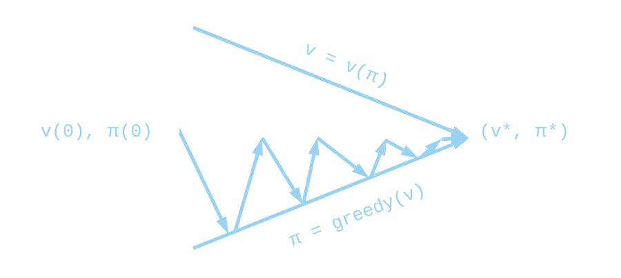



## What is a gridworld ?

Even though the name seems self-explanatory, I am still going to give some precisions.
This gridworld is 8 lines x 12 columns.
It represent an _environment_ in which our _agent_ is going to take _actions_.
The orange cell on the up left corner is the starting point of our _agent_.
The green one placed on the bottom right is the goal _state_, where we want to go.
You can drag your mouse on the grid to place traps which are going to be represented by red cells.
You can erase by placing air again and you can also change the position of the starting and the ending point.

We start at the first time step on the starting point $$ s_0 $$.
At each time step, we chose a possible action $$ a_t $$.
Here we can go down or right but not up or left because there is a wall.
Let's say that we chosed to go down $$ a_0 = down $$.
If there is a trap, we get a 'reward' of $$ -100 $$ and the game ends $$ r_0 = -100 $$.
If there is nothing, we get a reward of $$ -1 $$, $$ r_0 = -1 $$, and if we got to the end, we get a reward of $$ +100 $$ and the game ends $$ r_0 = 100 $$.
Note that we can define a terminal _state_ as a _state_ where every action takes you to the same _state_ with a reward of $$ 0 $$.
The goal is to finish the game with the maximum (discounted) reward possible $$ R = \sum_{t=0}^{+\infty} \gamma^t r_t $$.
That is why we give a negative reward when transitionning to a cell where there is nothing.
This tells us that the shortest path to the end is going to be better than making 3 times the tour of the map before going to the goal _state_.

The theory lying underground that will help us understand the way we design solving algorithms is __Reinforcement Learning__. 
It is based on a mathematical model that capture the essence of problem like this one called [__Markov Decision Process__][1]. 
In a deterministic __MDP__, you have:
  * a set of _states_ $$ S $$, where $$ S_t $$ is the subset of _states_ you can access at time step $$ t $$.
  * a set of _actions_ $$ A $$, where $$ A_t $$ is the subset of _actions_ you can chose at time step $$ t $$.
  * a _reward_ function $$ R $$, where $$ R(s, s') $$ is the _reward_ you get when transitionning from _state_ $$ s $$ to $$ s' $$.

## What is a policy, a state value and a Q-function ?

We first define the concept of _policy_.
The policy is a function $$ \pi : S \rightarrow A $$. In other words,
it takes a _state_ as an input and output an _action_ to take.
An agent is said to follow a policy $$ \pi $$ if $$  \forall t \in \mathbb{N}, a_t = \pi(s_t) $$ i.e. if it takes the action that the policy asks it to follow. 
We can now define what are a state-value and a Q-value (also called action-value) function given a policy:

$$ \begin{align}
  V^{\pi}(s_t) &= \mathbb{E}_{\pi} \left[\sum_{i = t}^{+ \infty} \gamma^{i-t} r_i \mid s_t \right] \\
  Q^{\pi}(s_t, a_t) &= \mathbb{E}_{\pi} \left[\sum_{i = t}^{+ \infty} \gamma^{i-t} r_i \mid s_t, a_t \right]
\end{align} $$

We already used $$ 0 < \gamma \leq 1 $$ three times without explaining what it was, it is called the _discount rate_.
It will set at what extent our agent is going to be concerned by long-time reward.
If $$ \gamma $$ is near $$ 0 $$, we are going to take into account only reward in the near future.
If, however, $$ \gamma $$ is near $$ 1 $$, we will considerate more long-lasting reward. 
Ok now, what about $$ V^{\pi} $$ and $$ Q^{\pi} $$ ? 
$$ V^{\pi}(s_t) $$ represents the future discounted reward, starting at $$ s_t $$ and following the policy $$ \pi $$. 
$$ Q^{\pi}(s_t, a_t) $$ is very similar, it is the future discounted reward, still starting at $$ s_t $$
but this time taking action $$ a_t $$ (possilbly different from $$ \pi(s_t) $$) before following the policy.

A policy which is going to maximize the future dicounted reward is called an optimal policy.
There can be several ones sometimes (for instance if transitioning to nothing would yield a reward of 0 and if the discounting factor was 1).  
Let's take one, we are going to call it $$ \pi^* $$, we also define the optimal
state-value function $$ V^* = V^{\pi^*} = \max_{\pi} V^{\pi} $$
as well as the optimal Q-value function $$ Q^* = Q^{\pi^*} = \max_{\pi} Q^{\pi} $$. Note that all optimal policies share the same state-value and action-value (Q-value) function because if one was higher than the others, the other ones wouldn't be optimal.

## Let's solve it !

The next remarks are going to be central for solving the problem,
they are the [Bellman Equations][2] of a deterministic _MDP_ (with deterministic policy).

$$ \begin{align}
  V^{\pi}(s_t) &= \sum_{i = t}^{+ \infty} \gamma^{i-t} r_i\\
  &= r_t + \sum_{i = t+1}^{+ \infty} \gamma^{i-t} r_i\\
  &= r_t + \gamma \sum_{i = t+1}^{+ \infty} \gamma^{i-(t+1)} r_i\\
  &= R(s_t, \pi(s_t)) + \gamma V^{\pi}(s_{t+1})
\end{align} $$

By the same reasoning we obtain the equation for the action-value function:

$$ \begin{align}
  Q^{\pi}(s_t, a_t) &= \sum_{i = t}^{+ \infty} \gamma^{i-t} r_i \mid a_t\\
  &= r_t + \gamma \sum_{i = t+1}^{+ \infty} \gamma^{i-(t+1)} r_i\\
  &= R(s_t, s(s_t, a_t)) + \gamma V^{\pi}(s(s_t, a_t))
\end{align} $$

For the optimal state-value and action-value functions, we have:

$$ \begin{align}
  V^*(s_t) &= R(s_t, \pi^*(s_t)) + \gamma V^*(s_{t+1})\\
  Q^*(s_t, a_t) &= R(s_t, s(s_t, a_t)) + \gamma V^*(s(s_t, a_t))
\end{align} $$

We can also remark that $$ V^*(s) = \max_a Q^*(s, a) $$ and inject it in the last equation:

$$  Q^*(s_t, a_t) = R(s_t, s(s_t, a_t)) + \gamma \max_{a_{t+1}} Q^*(s(s_t, a_t), a_{t+1}) $$

## Policy Iteration

The first method we are going to use is called Policy Iteration.
We initialize the state-value function with a random one or we can also initialize it at 0 for every state.
We, then, derive a better policy from this state-value.
We calculate the new state-value and again a new better policy,
and so on until the policy is stable.

### Policy Evaluation

We first need a method in order to estimate the state-value function of a policy.
We could solve the $$ \mid S \mid $$ equations with $$ \mid S \mid $$ unknowns,
but we are instead going to use a simpler and less computationally expensive way.
This technique is called _Policy Evaluation_.
For this, we want to use the Bellman equation as an update rule for our state-value estimation:

$$ V_{k+1}(s) = R(s, \pi(s)) + \gamma V_k(\pi(s)) $$

We can then have two arrays, one for the old values and one for the new values calculated from the old ones.
We can also do it in-place with one array, replacing values as we go through $$ S $$.
Although the latter is usually faster to converge it is anisotropic in the sense that
the order we are going to do the updates is going to matter.
In this example, we are going to use the two array version.
Here, 'N' is the number of rows, 'M' the number of columns and
'transition' is a function that gives the next _state_ and the _reward_ given the current _state_ and _action_.
Finally, treshold is a small value that will determine when we stop the iterations.

~~~ python
def policy_evaluation(policy: list[list], treshold: float, V_init=None) -> list[list]:
  """
  policy: 2D array where each state in the grid is assigned an action
  treshold: This controls the precision of the convergence
            to the ground-truth state-value function
  """
  if not is_instance(V_init, None):
    V_old = copy.deepcopy(V_init)
    V_new = copy.deepcopy(V_init)
  else:
    V_old = [[0]*M for _ in range(N)]
    V_new = [[0]*M for _ in range(N)]

  while True:
    delta = 0

    for i in range(N):
      for j in range(M):
        i_, j_, r = transition(i, j, policy[i][j])
        V_new[i][j] = r + gamma*V_old[i_][j_]

        delta = max(delta, abs(V_new[i][j] - V_old[i][j]))

    if delta < treshold:
      break

    V_old = copy.deepcopy(V_new)
  
  return V_new
~~~

### Policy Improvement
Once we have evaluated the state-value function,
we change our policy for a better one according to this state-value function:

$$ \pi'(s) = \text{argmax}_a [r(s, s(s, a)) + \gamma V(s(s, a))] $$

~~~ python
def policy_improvement(V: list[list]) -> list[list]:
  """
  V: value-state function
  """
  policy = [[]*M for _ in range(N)]

  for i in range(N):
    for j in range(M):
      best = float("-inf")
      best_action = 0

      for action in range(4):
        i_, j_, r = transition(i, j, a)
        if r + gamma*V[i_][j_] > best:
          best = r + gamma*V[i_][j_]
          best_action = action

      policy[i][j] = best_action

  return policy
~~~

### Final Algorithm

We write an helper function to determine if the policy is stable:

~~~ python
def is_stable(p1, p2) -> bool:
  for i in range(N):
    for j in range(M):
      if p1[i][j] != p2[i][j]:
        return False

  return True
~~~

We can now write the full function:

~~~ python
def policy_iteration(treshold: float=1e-5) -> list[list]:
  V = [[0]*M for _ in range(N)]
  pi = [[0]*M for _ in range(N)]

  while True:
    V = policy_evaluation(pi, treshold, V)
    new_pi = policy_improvement(V)

    if is_stable(pi, new_pi):
      break

    pi = new_pi
  
  return new_pi
~~~

We can remark that we use the previous state-value function for evaluating the next one.
This have the effect of greatly speeding up the evaluation step.

## Value Iteration

In Policy Iteration, we were estimating the state-value function of the policies until reasonable convergence.
In Value Iteration, we instantly greedify the policy between the sweeps for state-value evaluation.
It discards the need for actually computing the policy between each evaluation.

~~~ python
def value_iteration(treshold: float=1e-5) -> list[list]:
  V_old = [[0]*M for _ in range(N)]
  V_new = [[0]*M for _ in range(N)]

  while True:
    delta = 0

    for i in range(N):
      for j in range(M):
        best = float("-inf")

        for a in range(4):
          i_, j_, r = transition(i, j, a)

          v = r + gamma*V_old[i_][j_]
          if v > best:
            best = v

        V_new[i][j] = best
        delta = max(delta, abs(V_new[i][j] - V_old[i][j]))

    if delta < treshold:
      break

    V_old = copy.deepcopy(V_new)

  return policy_improvement(V_new)
~~~

In practice, we usually don't use this algorithm in this form:
a few steps of classical evaluation are put in between two _Value Iteration_ steps.
If Value Iteration can be seen as one step of evaluation followed by one policy improvement,
this version of the algorithm can be seen as $$ k $$ steps of evaluation followed by an improvement one.

## SARSA

With SARSA and Q-Learning we are going to be estimating Q instead of V and derive the optimal policy from it.
Another difference with these methods is that we are going to be simulating episodes
through the gridworld in order to estimate the Q-function instead of sweeping through the _state_ space $$ S $$. 
SARSA stands for State-Action-Reward-State-Action because we are going to look one action forward following the policy to estimate $$ Q(s,a) $$.
In fact we are not always going to follow the policy because it can be biased if it had not tried certain actions.
To ensure that we explore the state-action space we need to take a random action once in a while and to start at a random valid position on the grid.
Since we don't need to explore as much as in the beginning episodes after episodes we can decrease the probability over time.
This probability of chosing a random action in a given _state_ is represented by $$ \varepsilon $$
which decreases in $$ \frac{1}{t} $$ where $$ t $$ represent the epsiode.

~~~ python
def choose_action(pi, i, j, eps_0, T, t):
  eps = eps_0/(1+(t/T))

  if random() < eps:
    a = randint(0, 3)
  else:
    a = pi[i][j]

  return a
~~~

Here we use $$ \varepsilon = \frac{\varepsilon_0}{1+t/T} $$. $$ \varepsilon_0 $$ is $$ \varepsilon $$ at time-step $$ t=0 $$ and $$ T $$
represents the decreasing period. Choosing a random action with probability $$ \varepsilon $$ and the greedy action otherwise
is called an $$ \varepsilon $$-greedy policy.

~~~ python
def SARSA(num_iter: int, alpha:float, gamma: float, eps_0: float, T: int) -> list[list]:
  """
  num_iter  :   Number of simulation episodes
  alpha     :   Update rate of our algorithm
  gamma     :   Discount rate
  """
  Q = [[[0]*4 for _ in range(M)] for _ in range(N)]
  pi = [[randint(0, 3) for _ in range(M)] for _ in range(N)]

  for t in range(num_iter):
    i, j = valid_random_init()
    a = choose_action(pi, i, j, eps_0, T, t)

    while True:
      i_, j_, r = transition(i, j, a)
      a_ = choose_action(pi, i_, j_, eps_0, T, t)

      Q[i][j][a] = (1 - alpha)*Q[i][j][a] + alpha*(r + gamma*Q[i_][j_][a_])
      
      i, j, a = i_, j_, a_
      if is_terminal(i, j):
        break

    pi = Q_to_policy(Q)

  return pi
~~~

Remark that we do not completely update $$ Q(s,a) $$ to $$ r + \gamma*Q(s', a') $$,
we make a step in that direction of proportion $$ \alpha $$, this parameter is the 
learning rate of our algorithm.

## Q-Learning

Q-Learning is basically the same as SARSA, it only differs in its update rule:
instead of choosing a second action following the $$ \varepsilon $$-greedy policy,
we choose the best _action_ available in _state_ $$ s' $$: $$ \max_{a'} Q(s', a') $$ which is,
in fact, the state-value of $$ s' $$: $$ V(s') $$ for the greedy policy.

~~~ python
def Q_Learning(num_iter: int, alpha:float, gamma: float, eps_0: float, T: int) -> list[list]:
  """
  num_iter  :   Number of simulation episodes
  alpha     :   Update rate of our algorithm
  gamma     :   Discount rate
  """
  Q = [[[0]*4 for _ in range(M)] for _ in range(N)]
  pi = [[randint(0, 3) for _ in range(M)] for _ in range(N)]

  for t in range(num_iter):
    i, j = valid_random_init()
    a = choose_action(pi, i, j, eps_0, T, t)

    while True:
      i_, j_, r = transition(i, j, a)
      a_ = choose_action(pi, i_, j_, eps_0, T, t)

      Q[i][j][a] = (1 - alpha)*Q[i][j][a] + alpha*(r + gamma*max(old_Q[i_][j_]))
      
      i, j, a = i_, j_, a_
      if is_terminal(i, j):
        break

    pi = Q_to_policy(Q)

  return pi
~~~

## Final Note

The code presented here is halfway between Python and pseudo-code as it does not define some functions.
If you want to see the actual code used here (JavaScript - p5), look [here][3].
Also, a lot of simplifications have been done in order to explain more directly
the different concepts. Finally, we only looked at the case of deterministic MDP with known model.
To have a better view of __Reinforcement Learning__, I recommend this [excellent book][4] about it
written by Sutton & Barto.

[1]: https://en.wikipedia.org/wiki/Markov_decision_process
[2]: https://en.wikipedia.org/wiki/Bellman_equation
[3]: https://github.com/devspaceship/devspaceship.github.io/tree/master/scripts/gridworld
[4]: http://incompleteideas.net/book/bookdraft2017nov5.pdf
